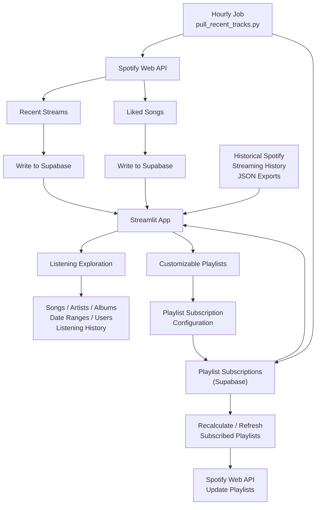

# Spotify Explorer

A personal Spotify data and playlist automation project built with Python, the Spotify Web API, Supabase, and Streamlit.

The project combines historical Spotify listening data with continuously collected recent activity to provide richer listening-history analysis and automatically maintained custom playlists.

## Overview

Spotify Explorer has three main components:

1. **Listening data collection** — pulls recent streams and liked songs from Spotify and persists them to Supabase.
2. **Listening-history analysis** — combines Spotify Extended Streaming History with newly collected data for long-term analysis.
3. **Playlist automation** — creates and maintains custom playlists based on liked songs, listening frequency, or combinations of existing playlists.

The project currently includes two Spotify accounts through separate OAuth sessions.

## Features

### Listening History

* Import historical Spotify Extended Streaming History JSON files
* Continuously append recent listening activity from the Spotify API
* Store new streams in Supabase
* Track listening activity by:

  * artist
  * song
  * album
  * date
  * user
* Combine historical exports with newly collected Spotify activity into a single dataset

### Liked Songs

* Pull newly liked tracks from Spotify
* Incrementally store liked-song history in Supabase
* Associate saved tracks with individual Spotify users
* Use liked-song data as a possible input to customizable playlists

### Custom Playlist Builder

The project supports several types of automatically maintained playlists.

#### Multi-Artist Liked Songs

Create a playlist containing liked songs from a selected set of artists.

Example:

```text
Liked songs from Insomnium, Dark Tranquillity, and Omnium Gatherum
```

When new songs from those artists are liked, the playlist can be updated during an hourly job.

#### Top Songs from Multiple Artists

Build a playlist using the most-streamed songs from selected artists. This is similar to the above playlist except song selections from each band are chosen by stream count rather than liked songs.

Options include:

* number of songs per artist
* all-time listening history or past-year listening history

For example:

```text
Top 5 songs from Insomnium, Dark Tranquillity, and Omnium Gatherum.
```

The playlist can be recalculated during the main hourly job as listening behavior changes.

#### Combine Playlists

Create a playlist representing the union of multiple Spotify playlists.

The combined playlist can be synchronized as tracks are added to or removed from its source playlists. The OAuth user must be a collaborator on both playlists.

Example: Izzy's Favorite 2026 Album Releases and Alex's 2026 Favorite Album Releases.

### Playlist Subscriptions

Automated playlists are stored as subscriptions in Supabase, including:

* Spotify playlist ID
* playlist type
* configuration parameters
* active/inactive status
* refresh cadence
* public/private status
* creation and update timestamps

Subscriptions can be updated, deactivated, and reactivated.

### Multi-User Support

The data model associates streams and liked songs with Spotify user IDs and display names.

The current implementation supports multiple authenticated Spotify accounts using separate OAuth token caches, up to the amount allowed by the Spotify dashboard. Currently, two are being used.

## Architecture

The application has two main execution layers:

an hourly automation job that collects new Spotify activity and maintains subscribed playlists
a Streamlit application that consumes listening data for exploration and provides the interface for configuring playlist subscriptions



## Project Structure

```text
spotify/
│
├── app.py
│   └── Streamlit interface for listening analysis and playlist management
│
├── spotify_data_collection.py
│   ├── Spotify OAuth configuration
│   ├── historical listening-history loading
│   ├── Supabase data loading
│   └── construction of the combined analysis dataset
│
├── pull_recent_tracks.py
│   ├── retrieves recent Spotify streams
│   ├── retrieves newly liked songs
│   ├── writes new activity to Supabase
│   ├── refreshes subscribed playlists
│   └── collects song metadata
│
├── playlist_builder.py
│   ├── playlist creation
│   ├── top-song selection
│   ├── playlist synchronization
│   ├── subscription updates
│   ├── deactivation/reactivation
│   └── playlist naming and configuration
│
├── spotify_helper_funs.py
│   ├── Supabase read/write helpers
│   ├── Spotify track metadata retrieval
│   ├── playlist retrieval
│   └── common Spotify helper functions
│
├── tests/
│   └── test_playlistbuilder.py
│
└── requirements.txt
```

## Tech Stack

* **Python**
* **pandas**
* **Streamlit**
* **Spotipy / Spotify Web API**
* **Supabase / Postgres**
* **pytest**
* **python-dotenv**

## Setup

### 1. Clone the repository

```bash
git clone https://github.com/izzybeers/spotify.git
cd spotify
```

### 2. Create and activate a virtual environment

```bash
python -m venv myenv
source myenv/bin/activate
```

On Windows:

```bash
myenv\Scripts\activate
```

### 3. Install dependencies

```bash
pip install -r requirements.txt
```

The integration tests also use `pytest`:

```bash
pip install pytest
```

### 4. Create a Spotify developer application

Create an application in the Spotify Developer Dashboard and configure an OAuth redirect URI.

The redirect URI in Spotify must exactly match the value supplied to the application.

### 5. Configure environment variables

Create a `.env` file in the project root:

```env
CLIENT_ID=your_spotify_client_id
CLIENT_SECRET=your_spotify_client_secret
REDIRECT_URI=your_redirect_uri

supabase_endpoint=your_supabase_project_url
supabase_api_key=your_supabase_api_key
```

Do not commit `.env` or Spotify OAuth token-cache files.

## Supabase

The project currently uses Supabase for several types of persistent data.

### `SpotifyStreams`

Stores newly collected listening activity.

Typical fields include:

* timestamp
* Spotify track URI
* artist
* album
* track
* user ID
* user name
* ingestion timestamp

### `SpotifyLikedSongs`

Stores liked-song history, including:

* Spotify URI
* artist
* album
* track
* liked timestamp
* user information

### `PlaylistSubscriptions`

Stores configuration and state for automatically maintained playlists.

### `SpotifySongInfo`

Stores additional track and album metadata retrieved from Spotify.

## Historical Spotify Data

Spotify's API only exposes limited recent-listening history, so the project can also ingest Spotify Extended Streaming History JSON exports.

Update the historical-data path in `spotify_data_collection.py` to point to the directory containing those files:

```python
json_path = Path("/path/to/spotify/data")
```

Historical records are combined with newer Supabase records to create a continuous listening dataset.

## Running the Data Collection

Run:

```bash
python pull_recent_tracks.py
```

The script:

1. authenticates each configured Spotify user
2. retrieves recently played tracks
3. checks the latest timestamp already stored in Supabase
4. inserts only new streams
5. retrieves newly liked tracks
6. inserts new liked-song records
7. checks playlist subscriptions affected by the new activity
8. updates applicable Spotify playlists
9. retrieves metadata for previously unseen tracks

The script is designed to be run periodically so that the Supabase database and automated playlists remain current.

## Running the Streamlit App

```bash
python -m streamlit run app.py
```

During development, automatic reruns on file saves can be enabled with:

```bash
python -m streamlit run app.py --server.runOnSave=true
```

The interface provides separate areas for listening-history analysis and playlist management.

## Testing

Playlist functionality has integration tests under:

```text
tests/test_playlistbuilder.py
```

Run them with:

```bash
pytest tests/
```

These tests interact with Spotify and Supabase rather than operating entirely on mocked data. They may create, modify, deactivate, reactivate, or delete test playlist subscriptions, so they should be run against accounts and infrastructure where those actions are expected.

## Authentication

Spotify authorization is handled through `SpotifyOAuth`.

Separate token-cache files are used for the currently configured Spotify accounts, allowing the collection process to authenticate multiple users independently.

The application requests permissions for functionality including:

* reading and modifying playlists
* reading saved tracks
* reading recently played tracks
* reading followed artists
* modifying followed artists
* uploading playlist artwork

## Design

A few design choices are central to the project:

### Incremental collection

The collection process checks the newest stored timestamps before writing new Spotify activity, avoiding a full historical reload on every run.

### Persistent playlist configuration

Automated playlist definitions are stored in Supabase rather than existing only in application memory. This allows playlists to be recreated and refreshed across separate processes.


### Historical + live data

The project combines Spotify's exported historical data with API-collected recent activity. This allows analyses and playlist rules to operate over a much longer listening history than the recent-play API alone exposes. Also, the historical data request from Spotify is static, so repeated recent-play API calls are necessary until the next historical data request is done.

## Current Status

This is an actively developed personal project. Current work includes improving the Streamlit analysis interface, playlist editing workflows, adding additional playlist types, multi-user handling, automated refresh behavior, and test coverage.

